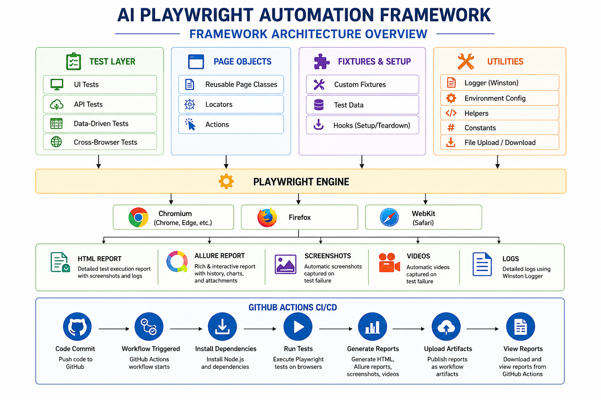
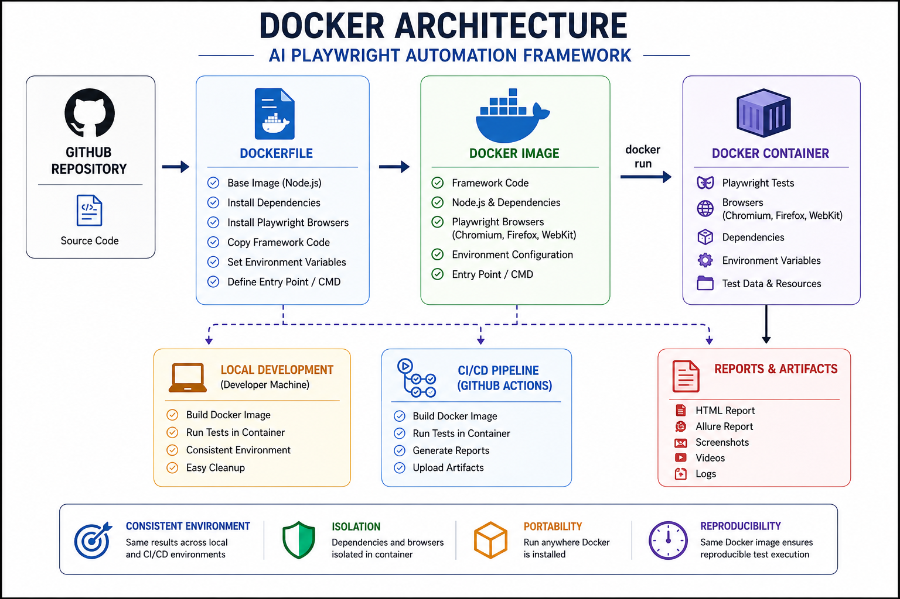
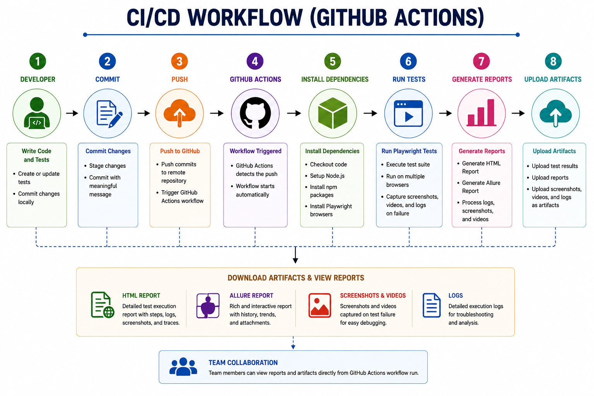
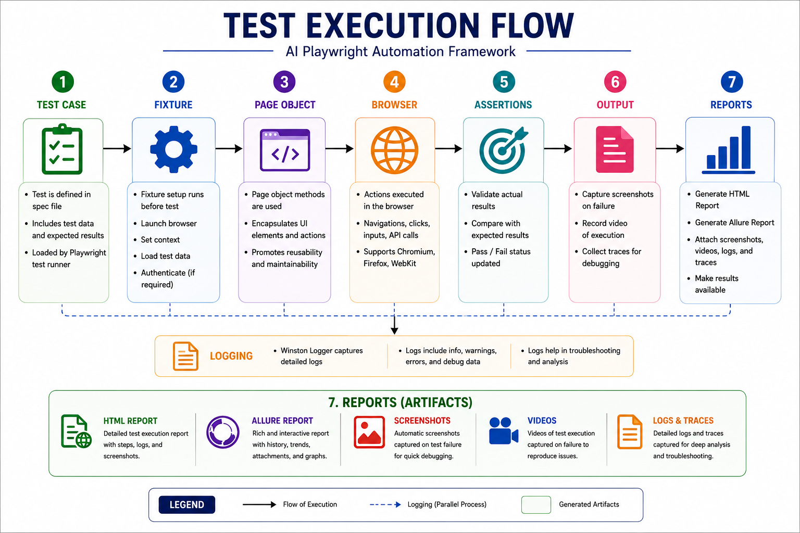

# 🤖 AI Playwright Automation Framework
A modern end-to-end UI and API automation framework built with Playwright, TypeScript, Docker, GitHub Actions, and Allure Reporting.

## Technologies

Playwright • TypeScript • Node.js • Docker • GitHub Actions • Allure • HTML Reports

## Project Overview

The AI Playwright Automation Framework is a scalable end-to-end test automation framework designed to demonstrate modern QA automation engineering practices.

The framework supports UI automation, API testing, cross-browser execution, structured logging, screenshots, video capture, HTML reporting, Allure reporting, Docker containerization, and GitHub Actions CI/CD.

The project follows the Page Object Model (POM) design pattern to improve maintainability, readability, and scalability. It serves as both a learning project and a production-style automation portfolio demonstrating industry best practices.

## ✨ Features

The AI Playwright Automation Framework includes the following capabilities:

### 🌐 UI Automation
- End-to-end UI automation using Playwright
- Cross-browser testing (Chromium, Firefox, and WebKit)
- Page Object Model (POM) design pattern
- Reusable page objects and fixtures
- Data-driven testing

### 🔌 API Automation
- REST API testing using Playwright APIRequestContext
- HTTP GET, POST, PUT, and DELETE requests
- Response validation
- JSON schema and payload verification

### 📊 Reporting & Observability
- Playwright HTML Reports
- Allure Reports
- Automatic screenshots on test failure
- Automatic video capture on test failure
- Trace Viewer support
- Winston logging framework
- Test execution logging

### 🚀 CI/CD
- GitHub Actions workflow
- Automatic test execution on push
- Playwright report artifacts
- Allure report generation
- Multi-browser execution

### 🐳 Docker
- Dockerized Playwright framework
- Consistent execution across environments
- Containerized test execution

### ⚙️ Framework Features
- Environment-specific configuration
- Custom Playwright fixtures
- Centralized logging
- npm scripts for simplified execution
- TypeScript support
- Modular project architecture

---

# 🛠️ Technology Stack

The framework is built using modern automation and DevOps technologies to provide a scalable, maintainable, and production-ready test automation solution.

| Technology | Purpose | Why It Was Chosen |
|------------|---------|-------------------|
| **Playwright** | UI & API Test Automation | Fast, reliable, and supports Chromium, Firefox, and WebKit from a single framework. |
| **TypeScript** | Programming Language | Provides static typing, improved code quality, and easier maintenance. |
| **Node.js** | Runtime Environment | Executes the Playwright framework and manages project dependencies. |
| **npm** | Package Management | Simplifies dependency management and script execution. |
| **Git** | Version Control | Tracks source code changes and supports collaborative development. |
| **GitHub** | Source Code Repository | Hosts the framework and enables collaboration and version management. |
| **GitHub Actions** | Continuous Integration / Continuous Deployment (CI/CD) | Automatically executes tests and publishes reports for every code change. |
| **Docker** | Containerization | Packages the framework and all dependencies into a portable, consistent execution environment. |
| **Allure Report** | Test Reporting | Generates rich, interactive reports with screenshots, videos, and execution history. |
| **Playwright HTML Report** | Test Reporting | Provides a detailed HTML report with traces, screenshots, and execution results. |
| **Winston** | Logging Framework | Captures structured application and test execution logs for troubleshooting. |
| **dotenv** | Environment Configuration | Loads environment-specific configuration values securely. |

---

# 🎯 Key Skills Demonstrated

This project demonstrates hands-on experience with modern QA automation engineering, software development, and DevOps practices.

| Category | Skills Demonstrated |
|----------|---------------------|
| **UI Test Automation** | Playwright, End-to-End Testing, Cross-Browser Testing (Chromium, Firefox, WebKit) |
| **API Testing** | REST API Testing, GET, POST, PUT, DELETE Requests, Response Validation |
| **Programming** | TypeScript, JavaScript (ES6+), Async/Await, Modular Design |
| **Framework Design** | Page Object Model (POM), Custom Fixtures, Reusable Components, Environment Configuration |
| **Reporting** | Playwright HTML Reports, Allure Reports, Screenshots, Video Capture, Trace Viewer |
| **Logging & Observability** | Winston Logging, Structured Logging, Failure Diagnostics |
| **CI/CD** | GitHub Actions, Automated Test Execution, Report Artifacts |
| **Containerization** | Docker, Docker Images, Docker Containers, Portable Test Execution |
| **Version Control** | Git, GitHub, Branching, Pull Requests |
| **Developer Experience** | npm Scripts, Environment Variables, Project Documentation |
| **Software Engineering Practices** | Clean Code, Code Reusability, Maintainability, Scalable Framework Design |
| **Agile Methodologies** | Scrum, Jira, User Stories, Acceptance Criteria, Incremental Delivery |

# 🏗️ Framework Architecture

The AI Playwright Automation Framework follows a modular architecture that separates test logic, page objects, utilities, fixtures, reporting, and CI/CD to promote maintainability and scalability.

## Overall Framework Architecture

The AI Playwright Automation Framework follows a modular architecture that separates test logic, page objects, fixtures, utilities, reporting, and CI/CD into independent layers. This design promotes maintainability, scalability, code reuse, and easier collaboration. Test execution flows through the Playwright engine across multiple browsers while automatically generating reports, logs, screenshots, and videos for comprehensive test analysis.


---

## Docker Architecture

The framework is containerized using Docker to provide a consistent execution environment across developer machines and CI/CD pipelines. The Docker image packages Playwright, browser dependencies, project source code, and configuration into a single portable container, ensuring reliable and reproducible test execution regardless of the host environment.



---

## GitHub Actions CI/CD Workflow

The GitHub Actions pipeline automates the continuous integration process by executing Playwright tests whenever code is pushed to the repository. The workflow installs project dependencies, runs the automated test suite, generates HTML and Allure reports, and uploads execution artifacts, enabling fast feedback and simplifying test result analysis.



---

## Test Execution Flow

This diagram illustrates the lifecycle of an automated test from execution to reporting. A test case initializes the required fixtures and page objects before interacting with the application through Playwright. After validation, the framework automatically captures logs, screenshots, videos, and trace files, then generates comprehensive HTML and Allure reports for debugging and analysis.



---

# 📁 Project Structure

```text
ai-playwright-automation-framework/
├── .github/                 # GitHub Actions workflows
├── docs/
│   └── images/              # Architecture diagrams
├── src/
│   ├── fixture/             # Custom Playwright fixtures
│   ├── pages/               # Page Object Model classes
│   └── utils/               # Logger, environment config, helpers
├── test-data/               # Test data files
├── tests/                   # UI and API test suites
├── screenshots/             # Failure screenshots
├── allure-results/          # Allure raw results
├── allure-report/           # Generated Allure reports
├── playwright-report/       # Playwright HTML reports
├── Dockerfile
├── package.json
├── playwright.config.ts
└── README.md
```

---

# 💻 Prerequisites

Before running the framework, ensure the following software is installed:

- Node.js 20+
- npm
- Git
- Docker Desktop (optional)
- Visual Studio Code (recommended)

Verify your installation:

```bash
node --version
npm --version
git --version
docker --version
docker compose version
```

---

# ⚙️ Installation

Clone the repository:

```bash
git clone https://github.com/your-username/ai-playwright-automation-framework.git
```

Navigate into the project:

```bash
cd ai-playwright-automation-framework
```

Install project dependencies:

```bash
npm install
```

Install Playwright browsers:

```bash
npx playwright install
```

---

# 🔧 Configuration

Environment-specific settings are managed using `.env` files.

Example:

- `.env.dev`
- `.env.qa`
- `.env.prod`

The framework automatically loads the appropriate environment configuration during execution.

---

# ▶️ Running Tests

Run all tests:

```bash
npm test
```

Run UI tests:

```bash
npm run test:ui
```

Run API tests:

```bash
npm run test:api
```

Run tests in headed mode:

```bash
npm run test:headed
```

Run tests with Playwright UI Mode:

```bash
npm run test:ui-mode
```

Run a specific test:

```bash
npx playwright test tests/example.spec.ts
```

---

# 📊 Test Reports

The framework automatically generates multiple report formats.

### Playwright HTML Report

```bash
npm run report
```

### Allure Report

```bash
npm run allure:generate
npm run allure:open
```

Reports include:

- Test Results
- Screenshots
- Videos
- Trace Files
- Execution Logs

---

# 🐳 Docker

Build the Docker image:

```bash
docker build -t ai-playwright-framework .
```

Run the Docker container:

```bash
docker run --rm ai-playwright-framework
```

Docker ensures consistent execution across local development and CI/CD environments.

---

# 🚀 GitHub Actions

The framework includes a GitHub Actions workflow that automatically:

- Installs project dependencies
- Installs Playwright browsers
- Executes automated tests
- Generates Playwright HTML Reports
- Uploads reports as workflow artifacts

This enables continuous integration and provides immediate feedback after every code change.

---

# 📝 Logging

The framework uses Winston to provide structured logging throughout test execution.

Logging captures:

- Test execution start and finish
- Browser information
- Execution duration
- Errors and failures
- Screenshot locations
- Video attachments

Logs simplify debugging and provide additional execution visibility.

---

# 🔮 Future Enhancements

Future improvements planned for this framework include:

- Parallel execution optimization
- Database testing
- Visual regression testing
- Accessibility testing
- Performance testing
- BrowserStack integration
- Azure DevOps pipeline support
- Slack and Microsoft Teams notifications

---

---

# 👩‍💻 Author

## Tanya Jenkins

Director of Quality Engineering | QA Automation Engineer

This framework was developed as a professional learning and portfolio project to demonstrate modern QA automation engineering practices using Playwright, TypeScript, Docker, GitHub Actions, and Allure Reporting.

GitHub: https://github.com/latanyaj82-wq

LinkedIn: *(https://www.linkedin.com/in/tanya-jenkins-8a969a40/)*